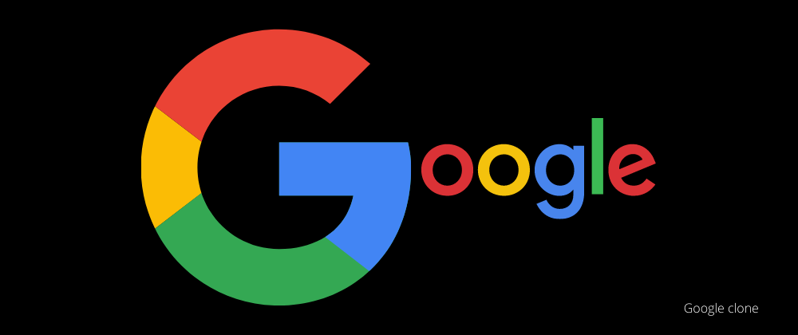

<h1>Google Clone - Animal Search</h1>

    

<h2>Overview</h2>
<ul>
    <li>This is a ReactJS project that serves as a clone of the Google search interface with a twist.</li>
    <li>Instead of searching the entire web, users can search for animals and get random animal information using the Faker.js library.</li>
    <li>This project demonstrates the implementation of a simple search feature using ReactJS and pure CSS for styling.</li>
</ul>

<h2>Features</h2>
<ul>
    <li>Search for animals by name or type.</li>
    <li>Fetches random animal information using Faker.js.</li>
    <li>UI designed with pure CSS without any UI library.</li>
</ul>

<h2>Technologies Used</h2>
<ul>
    <li>ReactJS: A JavaScript library for building user interfaces.</li>
    <li>Faker.js: A library for generating fake data, used here to simulate animal data.</li>
    <li>HTML and CSS: For structuring and styling the web application.</li>
</ul>

<h2>How to Run the Project</h2>
    <code>npm start</code> 
    <code>yarn start</code>
<h3>
    Clone the repository to your local machine:
</h3>

<ul>
    <li>
        HTTPS: <a href="https://github.com/danielagnelo/google-clone.git">https://github.com/danielagnelo/google-clone.git</a>
    </li>
    <li>
        SSH: <a href="git@github.com:danielagnelo/google-clone.git">git@github.com:danielagnelo/google-clone.git</a>
    </li>
</ul>

<h3>Navigate to the project directory:</h3>

    <code>cd google-clone</code>

<h3>Install the required dependencies:</h3>

    <code>npm install or npm i</code> 
    <code>yarn or yarn i</code>

<h3>Start the development server:</h3>

    <code>npm start</code> 
    <code>yarn start</code>

<h3>To run test:</h3>

    <code>npm test</code> 
    <code>npx jest src/components/tests/buscar.spec.js</code>

<h3>Open your browser and visit <a>http://localhost:3000</a> to view the application.</h3>

<h2>Usage</h2>
<ul>
    <li>In the search bar, type the name or type of the animal you want to search for.</li>
    <li>Press the Enter key or click the search button.</li>
    <li>The application will display random animal information based on your search query.</li>
</ul>

<h3>The project structure is organized as follows:</h3>

<ul>
    <li><code>src/</code>: Contains the source code of the React application.</li>
    <li><code>public/</code>: Contains static assets like HTML, images, and the project's entry point.</li>
    <li><code>package.json</code>: Defines project dependencies and scripts.</li>
</ul>

<h2>Contributing</h2>

    <strong>Contributions are welcome!</strong> 
    
Feel free to open issues or pull requests to improve the project.

<h2>License</h2>
<ul>
    <li>This project is open-source and available under the MIT License.</li>
</ul>

<h2>Acknowledgments</h2>
<ul>
    <li>This project was inspired by the Google search interface.</li>
    <li>Thanks to the Faker.js library for providing fake animal data.</li>
</ul>

<h2>Project Objectives</h2>
<ul>
    <li>Build this application as a production grade code. ✔</li>
    <li>Focus on replicating the given screenshots/design ✔</li>
    <li>Provide at least one test validating some use cases ✔</li>
    <li>What would you have done differently if you had more time?
        <ul>
            <li>Rigorous Testing Implementation: I would have carried out a more comprehensive battery of tests to check for possible errors and ensure project stability. Additional testing is essential because it can uncover issues that may not be apparent initially, thereby enhancing the software's quality.</li>
            <li>Image Anchoring: Adding an anchor to images, positioning them on the right side of the selected object/item, would have significantly improved the user experience. This would make the interface more intuitive and facilitate the comprehension of the content. The reason for this is that it would make it easier for users to associate images with specific items, leading to a more seamless interaction.</li>
            <li>Responsive Layout for Smartphones: I acknowledge the importance of delivering a consistent user experience across all devices, including smartphones. Therefore, if I had more time, I would work on creating a layout that is better suited for mobile devices, drawing inspiration from successful approaches such as Google's responsive design in their smartphone applications. This would ensure that users have a smooth and enjoyable experience, regardless of the device they are using. The rationale behind this is that catering to mobile users is essential in today's digital landscape, and a responsive layout would lead to higher user satisfaction and engagement.</li>
        </ul>
    </li>
    <li>Why?
        <ul>
            <li>
                These additional actions would be beneficial because they would not only enhance the project's quality but also increase overall user satisfaction and usability. Having more time to refine these aspects would have a positive impact on the project's overall success."
            </li>
        </ul>
    </li>
</ul>